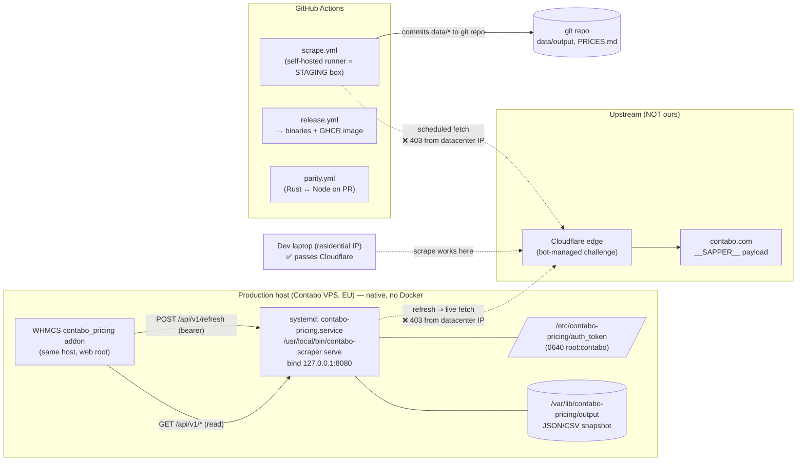
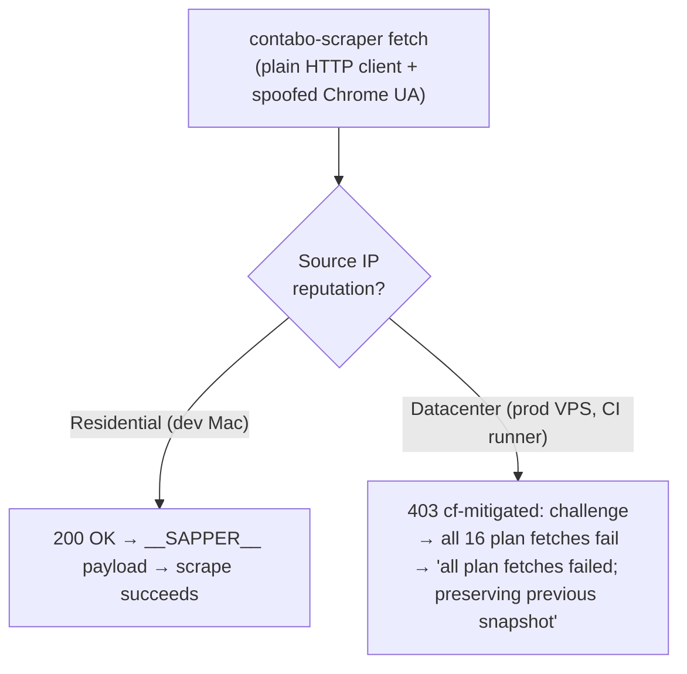
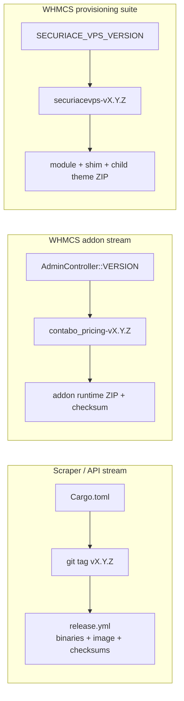
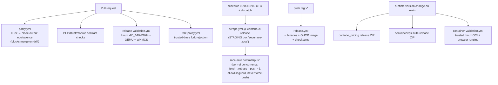

# Contabo Pricing Scraper + API

Extracts pricing for all Contabo Cloud VPS, Storage VPS, and Cloud VDS plans from Contabo's embedded `__SAPPER__` server-side payload. Outputs structured JSON and CSV files ready for analysis or further automation — **and exposes the data as a versioned REST API** for downstream integrations (WHMCS, dashboards, billing systems).

Ships as a single Rust binary with two subcommands:

```bash
contabo-scraper scrape      # one-shot scrape (the original behaviour)
contabo-scraper serve       # long-running HTTP API
```

Plus a Docker image with Caddy / Traefik / Coolify overlays. See [`deploy/README.md`](deploy/README.md) for the container recipes.

## WHMCS-native VPS suite

This repository now carries the complete supported WHMCS integration:

- the Rust service publishes versioned, read-oriented catalog and quote data;
- `contabo_pricing` 1.0.0 imports that catalog, publishes mappings and prices,
  and seals paid-order snapshots;
- `securiacevps` 2.0.0 is the canonical WHMCS provisioning module, backed by
  module-owned MySQL operations and WHMCS cron;
- `contabo_vps` is a staged migration shim only;
- `templates/orderforms/securiace-vps` is a Standard Cart child for VPS product
  discovery and configuration.

The target runtime has no Python, PostgreSQL, Redis, Celery, or FastAPI
dependency. Rust owns catalog intelligence; WHMCS owns customers, billing,
authorization, snapshots, and lifecycle intents; Contabo owns provider resource
observations. See the [architecture](whmcs-module/modules/addons/contabo_pricing/docs/WHMCS_NATIVE_ARCHITECTURE.md),
[provisioning contract](whmcs-module/modules/addons/contabo_pricing/docs/PROVISIONING_CONTRACT.md),
and [operator runbook](whmcs-module/modules/addons/contabo_pricing/docs/DEPLOY_RUNBOOK.md).

> **Historical operations snapshot:** the section below records an observed
> May 2026 deployment and is not deployment authorization or current-state
> verification. Release preparation is local-only; production rollout follows
> the operator-controlled runbook above.

## Runtime prerequisites

- Rust primary path: Rust toolchain + Cargo (for source builds), or Docker (for container runs).
- Node.js path (legacy/fallback): Node.js >= 18.
- Optional tooling in examples: `jq`, `openssl`, `curl`.

## API quick start

```bash
# Build + run locally
cargo build --release
./target/release/contabo-scraper serve --bind 127.0.0.1:8080 --auth-token "$(openssl rand -hex 32)"

# Or via Docker
docker build -t contabo-pricing .
docker run --rm -p 8080:8080 -e CONTABO_AUTH_TOKEN=secret contabo-pricing
```

Endpoints (versioned under `/api/v1`):

| Method | Path | Auth | Purpose |
|---|---|---|---|
| GET | `/api/v1/health` | open | liveness |
| GET | `/api/v1/meta` | open | version + snapshot freshness |
| GET | `/api/v1/plans` | open | list plans (`?family=Cloud VPS`) |
| GET | `/api/v1/plans/:slug` | open | one plan |
| GET | `/api/v1/plans/:slug/configurator` | open | option matrix + defaults |
| GET | `/api/v1/options` | open | flat option catalog |
| GET | `/api/v1/fx` | open | EUR→INR rate + source + age |
| POST | `/api/v1/quote` | open | calculate configured price (GST + FX) |
| POST | `/api/v1/refresh` | **bearer** | trigger async scrape |
| GET | `/api/v1/jobs/:id` | open | refresh job status |
| GET | `/` | open | the interactive report (embedded HTML) |

Auth model: read endpoints are open and cacheable; `POST /refresh` requires `Authorization: Bearer <token>` matching `--auth-token` / `--auth-token-file` / `CONTABO_AUTH_TOKEN`. When no token is configured the mutating endpoint returns 503 (fail-closed).

---

## Production Architecture & Operational Reality (Dev + Ops Deep Dive)

> _Updated 2026-05 from a live production investigation. This section is the
> source of truth for **what is actually deployed** and the constraints that
> govern it. Where earlier docs imply Docker/“built-in cron”, trust this section._

### TL;DR for operators

| Question | Answer (as-deployed) |
|---|---|
| How does prod run the API? | **Native `systemd` unit** `contabo-pricing.service` → `/usr/local/bin/contabo-scraper serve`. **Not Docker.** |
| Where is the data? | `CONTABO_DATA_DIR=/var/lib/contabo-pricing/output` (on the prod host's disk) |
| How does WHMCS reach it? | Same host, `http://127.0.0.1:8080/api/v1` (loopback only; `CONTABO_BIND=127.0.0.1:8080`) |
| How is data refreshed? | **Manually** today — `POST /api/v1/refresh` (bearer). **No cron/timer is installed**, and `CONTABO_REFRESH_CRON` is **not wired** in code. |
| Why does data go stale / refresh fail? | **Contabo is behind Cloudflare**, which returns `403 (cf-mitigated: challenge)` to **datacenter IPs** (the prod VPS *and* CI runner). Only residential IPs pass. |
| Version streams? | Rust/API `v*`, addon `contabo_pricing-v*`, and provisioning suite `securiacevps-v*` are independent immutable releases. |
| Is the target source tracked? | Yes. Release workflows package only committed source. Any historical untracked production tree must be inventoried and reconciled before rollout. |

### System landscape



**Key insight:** every *automated/datacenter* fetch path (prod VPS, CI runner) is
Cloudflare-blocked; the historical "it worked on my Mac" is because a **residential
IP is not challenged**. The git-committed `data/output` (from `scrape.yml`) and the
prod host's `/var/lib/contabo-pricing/output` are **separate stores** — the scrape
workflow does not feed prod.

### 1) As-deployed production runtime (native systemd)

```ini
# /etc/systemd/system/contabo-pricing.service  (as observed on prod)
[Service]
User=contabo
Environment=RUST_LOG=info
Environment=CONTABO_BIND=127.0.0.1:8080
Environment=CONTABO_DATA_DIR=/var/lib/contabo-pricing/output
Environment=CONTABO_AUTH_TOKEN_FILE=/etc/contabo-pricing/auth_token
ExecStart=/usr/local/bin/contabo-scraper serve
Restart=on-failure
RestartSec=5
```

- Binary `2.3.0-dev`, **built on the prod host** from `/opt/contabo-pricing-src` and
  installed to `/usr/local/bin/contabo-scraper`. The git repo's `Dockerfile`/`deploy/`
  are **not** the live deploy path.
- Bind is **loopback-only** — the API is reachable only by same-host WHMCS; there is
  no public ingress, so the bearer gate on `/refresh` is defence-in-depth, not the
  only control.
- Read endpoints serve an **in-memory snapshot** (see §3); a failed refresh never
  takes the API down.

Read-only health/identity checks an operator can run on the prod host:

```bash
systemctl status contabo-pricing.service
ss -ltnp | grep ':8080'                       # → users:(("contabo-scraper",...))
curl -s http://127.0.0.1:8080/api/v1/health   # {"status":"ok",...}
curl -s http://127.0.0.1:8080/api/v1/meta | jq '.snapshot_meta.generated_at'
ls -la /var/lib/contabo-pricing/output/       # data files + mtimes
```

### 2) Upstream access constraint — Cloudflare bot-challenge (the #1 ops issue)

`contabo.com` sits behind Cloudflare with a **managed bot challenge**. From a
datacenter IP the scraper receives:

```
HTTP/2 403
server: cloudflare
cf-mitigated: challenge      ← Cloudflare is serving a JS/managed challenge, not the page
```



- **Neither** scraper can pass it: both the Rust (`reqwest`) and Node (`fetch`) paths
  send a **browser-like User-Agent only** — they do **not** execute the JS challenge,
  so a UA string is insufficient. The "Node fallback" is **not** a workaround here; it
  401/403s the same way.
- **Consequence (when unproxied):** the API **safely keeps the previous snapshot** — so
  prod serves *stale but valid* data, not empty/partial data.
- **✅ Resolved via option 3 — `SCRAPER_PROXY` (residential/gateway proxy).** Routing
  fetches through the proxy lets plain `reqwest` mode return `200` and `POST /refresh`
  pull fresh data. Wired in three places, credential never committed:
  - **prod**: `chmod 600` systemd drop-in `/etc/systemd/system/contabo-pricing.service.d/proxy.conf`
    → `EnvironmentFile=/etc/contabo-pricing/proxy.env` (`SCRAPER_PROXY=…`). See
    [deploy/README → Production scraper deploy](deploy/README.md#production-scraper-deploy-native--release-binary--proxy).
  - **CI**: `SCRAPER_PROXY` secret in the **`Build`** environment, consumed by `scrape.yml`
    (scheduled data pipeline) and `parity.yml` (Rust↔Node equivalence).
  - the scraper reads `SCRAPER_PROXY` natively (clap `env=`); a schemeless value is
    normalized to `http://` (≥ the normalize fix), but always supply the scheme for ≤ v2.3.2.
- Other options, not used: scrape from a non-datacenter IP and ship JSON to `CONTABO_DATA_DIR`;
  a headless-browser challenge-solver (CloakBrowser, kept only as a legacy fallback); an
  unprotected upstream feed.

> With the proxy in place, a refresh timer is now viable — periodic `POST /api/v1/refresh`
> (cron / `systemd` timer) pulls fresh data twice a day instead of 403-ing.

### 3) Data freshness & the refresh lifecycle

```mermaid
sequenceDiagram
  participant Op as Operator/Cron
  participant API as contabo-scraper serve
  participant CB as contabo.com (Cloudflare)
  participant FS as CONTABO_DATA_DIR
  Op->>API: POST /api/v1/refresh (Bearer)
  API-->>Op: 202 {job_id, status:"queued"}
  Note over API: refresh_lock mutex — no overlapping jobs
  API->>CB: live fetch 16 plans (compiled-in ALL_PLAN_URLS)
  alt all fetches succeed
    API->>FS: write JSON/CSV
    API->>API: reload + ATOMIC in-memory snapshot swap (RwLock)
    Note over API: readers see old snapshot until swap completes
  else any/all fail (e.g. Cloudflare 403)
    API->>API: preserve previous snapshot (no data loss)
    Note over API: job → "failed"; /meta unchanged
  end
  Op->>API: GET /api/v1/jobs/{id} (poll)
```

- `/refresh` is **async** (returns `job_id` immediately); poll `GET /api/v1/jobs/:id`.
- Refresh re-scrapes the **compiled-in 16-plan list** (`plan_urls_file: None`) — it does
  **not** use a curated `data/plan_urls.json`.
- **Atomic + safe:** snapshot held behind `RwLock`; swapped only after a successful
  scrape; previous snapshot preserved on any failure. WHMCS reads stay consistent
  throughout (it reads the API, never partial files).
- **Freshness automation does not exist on prod** (no cron, no `systemd` timer,
  `CONTABO_REFRESH_CRON` unwired). **Recommended durable fix** (install only after the
  Cloudflare path works): a `systemd` timer that POSTs `/refresh` twice daily —

```ini
# contabo-pricing-refresh.timer  (DRAFT — install after upstream fetch is fixed)
[Timer]
OnCalendar=*-*-* 06:10:00
OnCalendar=*-*-* 18:10:00
RandomizedDelaySec=10m
Persistent=true
```
> The refresh trigger returns on the async `202`, so the timer's exit code does **not**
> prove the scrape worked. **Monitor `/api/v1/meta` `generated_at`** (alert if older
> than ~26h), not the trigger.

### 4) Versioning and release streams



| Stream | Version source | Tag convention | Build/publish |
|---|---|---|---|
| Scraper / API | `Cargo.toml` | `vX.Y.Z` | Cross-platform binaries, checksum, and immutable image |
| WHMCS addon | `AdminController::VERSION` | `contabo_pricing-vX.Y.Z` | Runtime-only addon ZIP, manifest, and checksum |
| WHMCS provisioning suite | `SECURIACE_VPS_VERSION` | `securiacevps-vX.Y.Z` | Canonical module, compatibility shim, child order form, manifest, and checksum |

### 5) CI/CD pipelines



- All workflows run on repository-scoped Linux self-hosted runners. Pull-request
  validation targets the Dockerless `contabo-ci-pr` identity; trusted release and
  scrape jobs target `contabo-ci-release`. Fork pull requests cannot claim either
  workflow. A trusted-base `pull_request_target` policy check fails closed for
  external forks without checking out or executing their code. See the
  [runner operations contract](docs/operations/self-hosted-runners.md).
- **`scrape.yml`** runs on the trusted **staging** identity, not prod.
  Its commit step was hardened (2026-05): per-ref `concurrency`, `fetch-depth: 0`,
  fetch→rebase→push retry (×3), an allowlist guard that refuses anything outside
  `data/output/**`, `data/plan_urls.json`, `PRICES.md`, `report.html`, and it **never
  force-pushes**. Its `latest` selector accepts only a non-draft, non-prerelease
  semantic-version scraper release containing the Linux x86_64 binary and checksum
  manifest, so WHMCS-only release tags cannot be selected. Note: this runner is also
  a datacenter IP, so its scrapes are subject to the same Cloudflare 403.
- **`parity.yml`** runs on PRs touching scraper code (excluding `src/api/**`, the
  Rust-only web server) and fails on Rust↔Node output drift. Both scrapers fetch
  through **`SCRAPER_PROXY`** — a GitHub *environment* secret in the **`Build`**
  environment — which bypasses the Cloudflare datacenter-IP 403, so the check does
  a **real** diff on the repository PR runner.
  It reports `plans scraped — rust=N node=M`, fails if either side pulls 0 plans,
  and skips **neutrally** only when *both* scrapers are upstream-blocked (proxy
  absent/down) so it never false-fails. A schemeless proxy value is normalized to
  `http://` in both scrapers.
- **`release.yml`** fires on `v*` tags → builds Linux x86_64 and ARM64 static
  binaries (zigbuild for musl) and a multi-arch Linux GHCR image. macOS and
  Windows artifacts are not part of the supported release contract. Immutable
  `:vX.Y.Z` and `:X.Y.Z` image tags are smoke-tested before `:latest` is promoted;
  the GitHub Release is created only after both binaries and the image pass.
- **`release-validation.yml`** is the non-publishing release gate: it cross-builds
  both supported Linux binary architectures, executes them through native/QEMU
  paths, validates the current scraper release checksum, and builds both WHMCS
  package streams on the Dockerless PR identity.
- **`container-validation.yml`** builds multi-arch OCI and exercises the real
  browser runtime on the Docker-enabled release identity only for trusted
  `main` source or an explicit maintainer dispatch. It has no pull-request trigger.
  A YAML-aware contract follows local reusable workflows and blocks direct,
  matrix, inline-trigger, and unauditable external-reusable paths from PR code
  to the release runner.
- **`release-contabo-pricing.yml`** publishes the runtime-only addon archive
  when `AdminController::VERSION` changes.
- **`release-contabo-vps.yml`** publishes the canonical module, migration shim,
  and VPS Standard Cart child together. Release workflows never deploy WHMCS.

### 6) Repo ↔ production source-of-truth gap (release hygiene)

The canonical API, addon, provisioning module, compatibility shim, order form,
tests, and package workflows are tracked. A release must come from a clean
commit and preserve its commit SHA, manifest, and checksums. Historical deployed
trees still require a read-only hash/diff inventory before rollout; observed
production state must never be inferred from the repository.

### 7) Ops runbooks

Use the [operator-controlled WHMCS release and migration runbook](whmcs-module/modules/addons/contabo_pricing/docs/DEPLOY_RUNBOOK.md).
Repository scripts validate and package; they do not connect to production.
Catalog/API operational changes use the separate deployment-specific runbook
and require current-state verification.

### 8) Dev runbooks

```bash
# Local API (residential IP — scrape works here)
cargo build --release
./target/release/contabo-scraper serve --bind 127.0.0.1:8080 --auth-token "$(openssl rand -hex 32)"

# One-shot scrape locally, then refresh prod's data out-of-band (mitigation §2.1):
cargo run --release -- scrape --output ./out
# scp ./out/* to the prod CONTABO_DATA_DIR, or POST the API from a residential host.

# Parity safety net before touching the parser (see parity.yml):
bash .github/scripts/parity_check.sh
```

### 9) Recent learnings (2026-05)

- Prod is **native systemd**, not Docker — earlier Docker-centric framing was a
  documentation drift, not the live system.
- The dominant freshness blocker is **Cloudflare bot-mitigation on datacenter IPs**,
  not scheduling or config. Residential IPs are unaffected.
- The refresh design's **preserve-on-failure** behaviour is doing its job — a blocked
  scrape degrades to "stale", never "broken".
- The WHMCS addon is **resilient to API outage**: every API-backed admin page degrades
  gracefully and the **billing/renewal path uses no API call**, so an API outage never
  threatens billing safety.
- **Three version streams** are independent: Rust/API, pricing addon, and
  provisioning suite.
- Release candidates are built from committed source with manifests and
  checksums; deployed state still requires explicit inventory.

---

## Node.js vs Rust — Deep Dive (Ops + Dev)

### Executive summary

| Scenario | Prefer | Why |
|---|---|---|
| Quick local scrape, ad-hoc validation | Node.js | Fastest zero-setup path for one-shot runs (`node scripts/contabo_scraper.js`) |
| Production API service with refresh jobs | Rust | Single binary, typed API/server state, async refresh jobs, auth middleware |
| Strict operations environments (repeatable deploy, controlled runtime) | Rust | One artifact + Docker overlays, explicit bind/auth/cron env model |
| Parser parity checks / fallback execution path | Both | Rust is primary; Node remains a useful fallback and parity reference |

### How each implementation works (internals)

**Node.js scraper flow**
- Fetch plan HTML with retry/backoff and browser-like headers.
- Extract embedded `__SAPPER__` payload from HTML script blocks.
- Evaluate payload, normalize plans/options, classify dimensions/categories.
- Inject defaults that exist in UI but are absent in payload.
- Write JSON/CSV artifacts and gap summaries.

**Rust scraper + API flow**
- Same `__SAPPER__` extraction + classification intent (kept close to Node behavior).
- Build typed structures and canonical outputs (`view_model`, consistency artifacts).
- In `serve` mode: hold snapshot in memory, expose versioned REST endpoints.
- `POST /refresh` spawns async job; state swaps atomically after successful scrape.
- ⚠️ `CONTABO_REFRESH_CRON` is **accepted as a flag/env but is not currently wired to a scheduler** — there is no in-app periodic refresh. Use an external cron / `systemd` timer (see [Production Architecture §3](#3-data-freshness--the-refresh-lifecycle)).

**Working mechanics (Rust serve mode)**
- `AppState` keeps the active snapshot in memory behind synchronization primitives for safe concurrent reads.
- Read endpoints (`/plans`, `/options`, `/meta`) stay open/cacheable while refresh runs in background.
- Refresh path is lock-guarded to prevent overlapping scrape jobs.
- On success, snapshot swap is atomic from API consumer perspective (no half-written state exposure).
- On failure, previous good snapshot remains active; failure is visible through job status and logs.

### Operations POV

| Capability | Node.js (`scripts/contabo_scraper.js`) | Rust (`contabo-scraper`) |
|---|---|---|
| Runtime model | One-shot CLI | One-shot CLI + long-running API server |
| Deployment | Node runtime required | Single binary; container-friendly |
| Auth model | N/A (local process) | Bearer auth on mutating endpoints (`/refresh`) |
| Fail-closed write path | N/A | Yes: no auth token => `/refresh` returns 503 |
| Scheduling | External cron only | External cron / `systemd` timer (the `CONTABO_REFRESH_CRON` knob is **not yet wired** — no in-app scheduler) |
| Refresh tracking | Exit code + files | Job IDs + status endpoint (`/api/v1/jobs/:id`) |
| Snapshot serving | Files only | In-memory snapshot + hot-reload + API metadata |
| Reverse-proxy recipes | Manual | Included overlays (Caddy/Traefik/Coolify) |

**Real ops runbook snippets**

```bash
# 1) Liveness + freshness
curl -fsS http://127.0.0.1:8080/api/v1/health
curl -s http://127.0.0.1:8080/api/v1/meta | jq '.snapshot_meta.generated_at'

# 2) Trigger refresh (token-protected)
TOKEN="$(cat deploy/auth_token.txt)"
JOB=$(curl -s -X POST \
  -H "Authorization: Bearer $TOKEN" \
  http://127.0.0.1:8080/api/v1/refresh | jq -r '.job_id')

# 3) Poll job status
curl -s "http://127.0.0.1:8080/api/v1/jobs/$JOB" | jq
```

```bash
# Diagnose auth fail-closed behavior (expected 503 when no token configured)
curl -i -X POST http://127.0.0.1:8080/api/v1/refresh
```

```bash
# Force Node fallback scraper from Rust API runtime (ops escape hatch)
CONTABO_SCRAPER_CMD="node /app/scripts/contabo_scraper.js" \
./target/release/contabo-scraper serve --bind 0.0.0.0:8080
```

### Developer POV

**Maintainability and extension tradeoffs**
- Node.js is concise and easy to tweak quickly for parser experiments.
- Rust adds stronger type guarantees and clearer boundaries between scrape outputs and API contract.
- Rust `scrape` + `serve` in one binary reduces drift between batch and service paths.
- Node remains valuable as a reference implementation when validating parser behavior.

**Typical change scenarios**
- Contabo changes script/end markers:
  - Update extraction markers in parser logic, then re-run with gap/consistency reports.
- New add-on appears (unclassified):
  - Extend classification rules and validate `contabo_gap_report.json` drops expected entries.
- New API field needed:
  - Add field to generated artifacts + handlers, then verify `contabo_consistency_report.json` and downstream consumers.

### Real examples

```bash
# Node.js one-shot (legacy/quick)
node scripts/contabo_scraper.js --json --quiet > result.json
node scripts/contabo_scraper.js --plans cloud-vps-10,vds-s
```

```bash
# Rust one-shot
cargo run --release -- scrape --json --quiet

# Rust API mode
./target/release/contabo-scraper serve --bind 127.0.0.1:8080 --auth-token "secret"

# Docker API mode
docker build -t contabo-pricing .
docker run --rm -p 8080:8080 -e CONTABO_AUTH_TOKEN=secret contabo-pricing
```

### Workflows (Ops + Dev)

#### Ops workflow: production refresh lifecycle

```text
Scheduler/Cron -> POST /api/v1/refresh (Bearer token)
               -> Job queued/running
               -> Scrape + transform + output validation
               -> Atomic snapshot swap on success
               -> GET /api/v1/meta reflects new generated_at
```

Operational checklist:
1. Confirm service health (`/health`) and freshness (`/meta`).
2. Trigger refresh and capture `job_id`.
3. Poll `/jobs/:id` until `succeeded` or `failed`.
4. If failed, inspect logs and keep serving previous snapshot.
5. Re-run refresh after remediation.

#### Ops workflow: secure deployment bootstrap

```bash
# 1) generate token file
openssl rand -hex 32 > deploy/auth_token.txt

# 2) start API stack
cd deploy && docker compose up -d

# 3) verify auth gate is fail-closed when token missing/invalid
curl -i -X POST http://127.0.0.1:8080/api/v1/refresh
```

#### Dev workflow: parser/classification change

1. Reproduce with a targeted plan subset (`--plans ...`) for quick iterations.
2. Update extraction/classification/default-injection logic.
3. Re-run scrape and inspect:
   - `contabo_gap_report.json`
   - `contabo_gap_summary.json`
   - `contabo_consistency_report.json`
4. Validate `report.html` calculator behavior against generated config outputs.
5. Run full-plan scrape before merge.

#### Dev workflow: Node parity safety net

```bash
# Node legacy output
node scripts/contabo_scraper.js --json --quiet > /tmp/node-result.json

# Rust output
cargo run --release -- scrape --json --quiet > /tmp/rust-result.json

# Compare key artifacts in your preferred diff tool
```

Use this when touching extraction markers, option classification, period math, or default-option behavior.

#### Incident workflow: Contabo HTML/payload drift

Symptoms:
- sudden spike in `sapper_extract_failed` or `unclassified` gaps
- refresh jobs failing while health remains green

Response:
1. Validate whether `__SAPPER__` markers changed.
2. Patch extraction marker logic and/or fallback parsing branch.
3. Run limited-plan validation, then full scrape.
4. Confirm gap/consistency reports return to expected range.
5. Deploy and monitor next scheduled refresh cycle.

### Known gaps, tradeoffs, and recent learnings

> See [Production Architecture & Operational Reality](#production-architecture--operational-reality-dev--ops-deep-dive) for the load-bearing 2026-05 findings: native-systemd prod runtime (not Docker), the Cloudflare datacenter-IP block on `contabo.com`, the missing refresh automation, the dual version streams, and the uncommitted API/deploy stack.

- Rust is the operational primary path; Node is intentionally retained for fallback/parity workflows.
- Mutating API operations are intentionally fail-closed; absence of token should be treated as configuration hard-stop, not degraded-open behavior.
- `contabo_consistency_report.json` is critical for catching transform drift between canonical view model and aggregate dataset.
- Deployment overlays are topology-specific: base compose, Caddy, Traefik, and Coolify each optimize different operational constraints.
- Performance statements should remain qualitative unless benchmark evidence is published in-repo.

### Migration guidance (Node -> Rust)

1. Keep artifact contracts stable (`contabo_*` outputs) while introducing Rust runs in parallel.
2. Run both scrapers during transition and compare outputs/gap summaries.
3. Switch downstream systems to Rust API endpoints (`/api/v1/*`) once parity is acceptable.
4. Retain Node fallback (`CONTABO_SCRAPER_CMD`) until operational confidence is established.

### Production hardening checklist

- Configure a non-empty auth token (`CONTABO_AUTH_TOKEN` or `CONTABO_AUTH_TOKEN_FILE`) before exposing `/refresh`.
- Keep `POST /refresh` behind network controls (reverse proxy ACL/VPN/private ingress) even with bearer auth enabled.
- Run with structured logs (`RUST_LOG=info` minimum) and collect logs centrally.
- Persist `CONTABO_DATA_DIR` on durable storage; do not rely on ephemeral container FS for production snapshots.
- Add an external freshness probe against `/api/v1/meta` and alert when `snapshot_generated_at` exceeds your SLA.
- Pin image tags/releases in production; avoid implicit `latest` rollouts.
- The container includes the optional CloakBrowser wrapper and its Linux shared
  libraries, but not the separately licensed browser binary. Cloak mode downloads
  that binary into `/home/contabo/.cloakbrowser` on first use; mount that path if
  the cache must survive container replacement.

### Troubleshooting matrix

| Symptom | Likely cause | Action |
|---|---|---|
| `POST /refresh` returns `503` | No auth token configured (fail-closed) | Set `--auth-token` or `CONTABO_AUTH_TOKEN(_FILE)` and restart |
| `POST /refresh` returns `401` | Missing/invalid bearer token | Verify `Authorization: Bearer <token>` matches configured value |
| Health is green, but prices stale | Refresh not running or failing | Trigger manual refresh, check `/api/v1/jobs/:id`, inspect logs |
| Spike in `unclassified` gaps | Contabo changed add-on labels/categories | Update classification rules and re-run parity/consistency checks |
| `sapper_extract_failed` gaps | HTML marker/payload structure changed | Patch extraction fallback markers and validate with subset runs |
| API starts but report/calculator incomplete | Snapshot/config artifacts missing or outdated | Re-run scrape and confirm `contabo_configs.json` + `view_model` generation |

### Verification gates before production rollout

```bash
# 1) build + smoke
cargo build --release
./target/release/contabo-scraper scrape --dry-run --json --quiet | jq '.status'

# 2) artifact quality gates
./target/release/contabo-scraper scrape --json --quiet > /tmp/scrape.json
test -f data/output/contabo_gap_summary.json
test -f data/output/contabo_consistency_report.json

# 3) API smoke
./target/release/contabo-scraper serve --bind 127.0.0.1:8080 --auth-token testtoken &
PID=$!
sleep 2
curl -fsS http://127.0.0.1:8080/api/v1/health
curl -fsS http://127.0.0.1:8080/api/v1/meta | jq '.schema_version'
kill $PID
```

### Release and rollback workflow

1. Build and validate scraper outputs in CI (including gap/consistency artifacts).
2. Deploy new version to staging and run one full refresh cycle.
3. Compare staging artifacts/API responses against baseline expectations.
4. Promote to production and monitor first scheduled/manual refresh.
5. If regression appears, roll back image/binary version and keep last good snapshot active while fixing forward.

### Contract boundaries (important)

- Contract stability applies to published artifacts and `/api/v1` endpoint shapes, not internal parser implementation details.
- `SCHEMA_VERSION` indicates data-model compatibility expectations for downstream consumers.
- Gaps are first-class outputs (`gap_report`, `gap_summary`) and should be monitored, not ignored.
- Node fallback exists for resilience and comparison, not as the recommended production control plane.

## WHMCS-native modules (Ops + Dev)

The repository includes the pricing/catalog addon, canonical provisioning module,
compatibility shim, and VPS order-form child.

- Module docs: [`whmcs-module/README.md`](whmcs-module/README.md)
- Architecture: [`WHMCS_NATIVE_ARCHITECTURE.md`](whmcs-module/modules/addons/contabo_pricing/docs/WHMCS_NATIVE_ARCHITECTURE.md)
- Provisioning contract: [`PROVISIONING_CONTRACT.md`](whmcs-module/modules/addons/contabo_pricing/docs/PROVISIONING_CONTRACT.md)
- Changelog and hardening notes: [`CHANGELOG.md`](whmcs-module/modules/addons/contabo_pricing/CHANGELOG.md)

### What it does

- Maintains **profiles** (plan/period/region/options templates) and immutable **profile versions**.
- Maps profiles to WHMCS products and selected billing cycles.
- Runs sync workflows that detect changes, persist version history, and optionally apply prices.
- Supports `manual`, `notify`, and `auto-apply` strategies per profile.
- Publishes immutable mapping versions and seals paid-order snapshots.
- Runs provider lifecycle work through durable MySQL operations and WHMCS cron.
- Reconciles unknown provider outcomes, verified service ownership, billing
  repair, one-time secrets, and customer-safe communications.

### Ops workflow (recommended)

1. Keep API server healthy/fresh (`/health`, `/meta`) before catalog imports.
2. Import, preview, validate, and publish one immutable mapping version.
3. Review profile, mapping, pricing, drift, and approval evidence in the addon.
4. Seal a paid-order snapshot before accepting a provisioning intent.
5. Monitor operations, attempts, unknown outcomes, adoption, reconciliation,
   billing repair, communications, and write switches.

### Dev workflow

1. Change scraper/API contract only with schema-awareness.
2. Validate downstream quote parity and profile version writes.
3. Test mapping/snapshot writes and lifecycle projections against WHMCS
   8.13.x/9.x schema and callback expectations.
4. Re-check addon and provisioning behavior after any catalog-contract change.
5. Build reviewable ZIPs with `scripts/package-whmcs-suite.sh`; never use the
   repository scripts to deploy production.

### WHMCS-specific operational lessons

- Treat raw DB fallback paths carefully; WHMCS schema differences can break naive writes.
- Keep token handling encrypted at rest in WHMCS settings (documented addon behavior).
- Prefer staged rollout: `notify` -> selective `auto-apply`, not blanket auto-apply on first sync.
- Preserve addon tables/history during upgrades; historical versions are critical for audit/rollback.

## Rust scraper status (current)

The Rust implementation is the current primary scraper/runtime and is a full port of the original Node scraper behavior with added API/server capabilities.

- Primary binary: `contabo-scraper` (`scrape` + `serve` subcommands)
- Primary deploy target: Rust binary/container
- Parity goal: Rust keeps output-contract compatibility with Node artifacts
- Node script role: compatibility fallback, parity reference, and emergency escape hatch

Use these commands for normal development/operations:

```bash
# one-shot scrape (Rust primary)
cargo run --release -- scrape

# API/server mode (Rust primary)
cargo run --release -- serve --bind 127.0.0.1:8080
```

## Legacy Node.js CLI documentation (compatibility mode)

This section documents the original Node.js CLI retained for compatibility, fallback workflows, and parity validation. It is not the primary runtime path.

## Requirements

- Node.js >= 18 (legacy CLI only; Rust path does not require Node for normal runs)

## Quick start

```bash
git clone https://github.com/yashodhank/contabo-pricing-scraper.git
cd contabo-pricing-scraper
node scripts/contabo_scraper.js
```

Output files are written to `data/output/` by default.

## Usage

```
node scripts/contabo_scraper.js [options]

OPTIONS
  -o, --output <dir>       Output directory       (default: data/output/)
  -c, --concurrency <n>    Parallel fetches        (default: 4)
  -r, --retries <n>        Retries per URL         (default: 3)
  -p, --plans <slugs>      Comma-separated plan slugs to limit scraping
  -q, --quiet              Suppress progress output (stderr stays active)
  -j, --json               Print JSON summary to stdout on completion
      --dry-run            Fetch pages but do not write any output files
  -v, --version            Print version and exit
  -h, --help               Show this help
```

### Examples

```bash
# Scrape all 16 plans (default)
node scripts/contabo_scraper.js

# Custom output directory
node scripts/contabo_scraper.js --output ./pricing-data

# Faster with higher concurrency
node scripts/contabo_scraper.js --concurrency 8

# Scrape a subset of plans
node scripts/contabo_scraper.js --plans cloud-vps-10,cloud-vps-20,vds-s

# Validate pages without writing files
node scripts/contabo_scraper.js --dry-run

# Machine-readable output for AI agents / pipelines
node scripts/contabo_scraper.js --json --quiet > result.json
node scripts/contabo_scraper.js --json --quiet | jq '.gaps'
```

## Exit codes

| Code | Meaning |
|------|---------|
| `0`  | All plans scraped and written successfully |
| `1`  | Fatal error — no output written |
| `2`  | Partial success — some plans failed, output written for the rest |

## Output files

All files are written to `--output` (default `data/output/`). The directory is created automatically.

| File | Description |
|------|-------------|
| `contabo_base_plans.json` | Base plan specs and all contract period pricing |
| `contabo_configs.json` | Per-plan configurator state (options grouped by dimension) |
| `contabo_pricing_dataset.json` | Combined dataset with metadata, plans, options, and gaps |
| `contabo_view_model.json` | Canonical render model — one flat row per plan × period, with options summary. Source for `report.html` |
| `contabo_base_plans.csv` | Flat CSV of base plans with pricing for all contract periods |
| `contabo_option_catalog.csv` | Normalized option catalog (one row per plan × option) |
| `contabo_gap_report.json` | Raw list of unclassified/failed items |
| `contabo_gap_summary.json` | Gap counts grouped by type |
| `contabo_consistency_report.json` | Reconciliation of `contabo_view_model.json` against `contabo_pricing_dataset.json` — flags scrape/transform drift |

> `data/output/` is excluded from git — run the scraper to regenerate.

## Interactive report

`report.html` (repo root) is a self-contained, interactive view of all plans: sortable
comparison table, 2–4 plan side-by-side compare, per-plan detail with an **interactive
plan + add-on cost calculator** (pick OS / region / storage / backup / networking and
see the live configured monthly, setup, and period total), dark mode. It is regenerated
alongside `PRICES.md`.

```bash
# Generate locally after a scrape (Node ≥ 18, no dependencies):
node scripts/contabo_scraper.js                 # or: cargo run --release
node .github/scripts/enrich_output.js           # enrich (recommended)
node .github/scripts/generate_html.js           # → report.html + consistency report
open report.html
```

The table/compare always work from `contabo_view_model.json`. The per-plan **calculator**
is driven by `contabo_configs.json` (present after any scrape); without it the detail
panel degrades to a static add-on list and the calculator is omitted. The default
configuration shown is anchored to the scraper's own `default_monthly_by_period`, and
`contabo_consistency_report.json` reconciles that arithmetic every run.

## Data model

### Base plan fields

| Field | Description |
|-------|-------------|
| `family` | `Cloud VPS`, `Storage VPS`, or `Cloud VDS` |
| `product_slug` | Contabo plan slug, e.g. `cloud-vps-10` |
| `fetched_at` | ISO 8601 timestamp of when this plan was fetched |
| `cpu`, `ram`, `base_storage` | Spec strings |
| `base_monthly_price` | Month-to-month price in EUR |
| `periods[]` | Per-period pricing: `months`, `effective_monthly`, `setup_fee`, `total_period_cost`, `discount_total` |

### Option catalog dimensions

| Dimension | Categories |
|-----------|------------|
| `Region` | Europe, America, Asia, Australia |
| `Storage Type` / `Storage` | NVMe, SSD |
| `Data Protection` | Auto Backup, None |
| `Networking` | Bandwidth, IPv4, Private Networking |
| `Image` | OS, Panels, Apps, Blockchain |

## How it works

1. Fetches each plan URL in parallel (configurable concurrency)
2. Extracts the `__SAPPER__` JSON payload embedded in the HTML
3. Classifies each add-on option into a normalized dimension/category
4. Injects known defaults that Contabo renders via HTML but not the payload
5. Deduplicates and sorts, then writes JSON and CSV

## Snapshots

`data/snapshots/` contains saved HTML pages used during parser development. Not tracked by git for production runs.

## License

MIT
